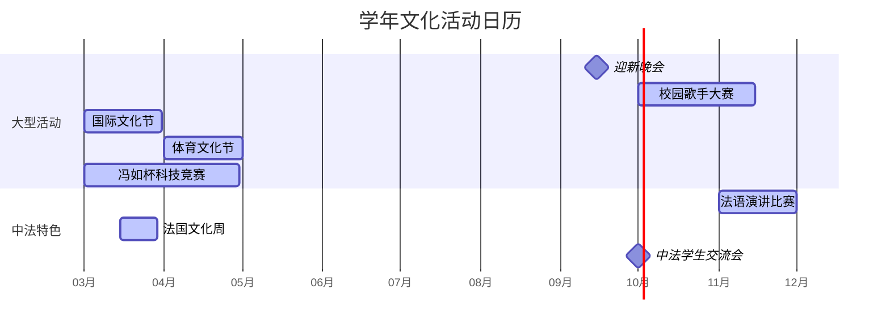

# 文化与活动

北航杭州国际校园融合了多所中外合作办学机构，文化氛围多元。
同时，杭州作为历史文化名城和互联网之都，为学生提供了丰富的课外活动和文化体验机会。

---

## 校园活动

### 学年活动日历

### 年度大型活动

| 活动 | 时间 | 简介 |
| ------ | ------ | ------ |
| 迎新晚会 | 9月 | 各学院和社团联合举办的欢迎新生晚会 |
| 校园歌手大赛 | 10月–11月 | 全校范围内的大型歌唱比赛 |
| 国际文化节 | 春季 | 展示各国文化、美食和交流活动 |
| 体育文化节 | 4月–5月 | 田径运动会、趣味运动项目 |
| 冯如杯科技竞赛 | 3月–5月 | 北航最具影响力的学生科技创新竞赛 |

### 中法特色活动

| 活动 | 时间 | 简介 |
| ------ | ------ | ------ |
| 法国文化周 | 春季 | 法式美食体验、电影放映、文化讲座 |
| 中法学生交流会 | 每学期 | 与法国交换生互动、语言交换 |
| 法语演讲比赛 | 秋季 | 各年级法语学习成果展示 |
| INSA 线上交流 | 定期 | 与法国 INSA 各校区同学线上互动 |

---

## 法语角

| 项目 | 详情 |
| ------ | ------ |
| 时间 | 每周固定时间（以学院通知为准） |
| 地点 | 学院教学楼专用教室或校园咖啡厅 |
| 形式 | 自由讨论、主题演讲、法语桌游、法语电影观影 |

!!! tip "法语角建议"

 - 不要怕犯错 — 法语角的核心目的是练习，而非完美
 - 提前准备 — 可以就本周话题准备几个想要讨论的问题
 - 多听多说 — 初级阶段的同学可以先多听，再慢慢加入讨论

---

## 学生社团

| 类型 | 社团 |
| ------ | ------ |
| 学术科技 | 数学建模协会、程序设计俱乐部、法语社、机器人协会 |
| 文艺兴趣 | 摄影协会、音乐社、话剧社、动漫社 |
| 体育 | 羽毛球协会、游泳协会、足球协会、健身与跑步 |

---

## 杭州文化体验

!!! quote "读万卷书，行万里路"

 杭州是中国最具魅力的城市之一，以"人间天堂"闻名于世。

### 必去景点

| 目的地 | 类型 | 交通时间 | 参考门票 |
| -------- | ------ | :------: | :------: |
| 西湖 | 世界文化遗产 | 地铁 60 分钟 | 免费 |
| 灵隐寺 | 千年古刹 | 公交+步行 70 分钟 | 45 元（学生半价） |
| 良渚古城遗址 | 世界文化遗产 | 骑行 25 分钟 | 80 元（学生半价） |
| 西溪湿地 | 国家级湿地公园 | 地铁 50 分钟 | 70 元（学生半价） |
| 龙井村 | 茶文化体验 | 公交 80 分钟 | 免费 |
| 浙江省博物馆 | 历史文物 | 地铁 60 分钟 | 免费（需预约） |

### 杭州特色体验

| 体验 | 说明 |
| ------ | ------ |
| 品龙井茶 | 清明前后去龙井村或梅家坞品春茶 |
| 西湖泛舟 | 手划船或画舫游湖 |
| 环湖骑行 | 沿西湖骑行约 15km |
| 看印象西湖 | 张艺谋导演的大型实景演出 |
| 逛河坊街 | 古街风情与杭州特产 |

### 周边城市探索

| 目的地 | 高铁时间 | 推荐理由 |
| -------- | :------: | ------ |
| 上海 | 45 分钟 | 国际化大都市，实习资源丰富 |
| 南京 | 1 小时 | 六朝古都，历史文化名城 |
| 苏州 | 1.5 小时 | 古典园林，江南水乡 |
| 黄山 | 1.5 小时 | 世界自然与文化双重遗产 |

!!! tip "杭州生活小贴士"

 - 下载大众点评和小红书，杭州吃喝玩乐信息非常丰富
 - 杭州多雨，随身带伞是基本功
 - 春天的樱花、秋天的桂花、冬天的梅花，杭州四季有花

---
*最后更新：2026年6月*

