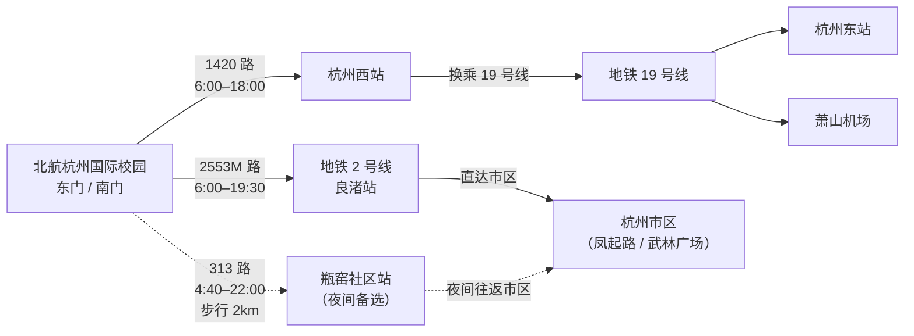

# 交通出行

北航杭州国际校园位于杭州市余杭区瓶窑镇双红桥街 166 号。学校东门、南门设有公交车站。

---

## 交通路线总览

---

## 校内交通

- 共享单车：校内设有，扫码使用
- 机动车：校内限速 30 km/h，地下车库限速 5 km/h，路边禁止停车。车辆可停中心组团地下车库
- 电动自行车：原则上不开放进入校园（依据《交通管理规定（试行）》）

---

## 校外公交

### 1420 路（毛元岭公交总站 — 浙大一院总部）

| 项目 | 详情 |
|------|------|
| 乘车站点 | 东门、南门公交站 |
| 时间 | 去程 6:00 – 18:00，返程 7:10 – 19:10 |
| 可达 | 杭州西站，转地铁 19 号线前往杭州东站、萧山机场 |

### 2553M 路（瓶窑公交总站 — 地铁杜甫村站）

| 项目 | 详情 |
|------|------|
| 乘车站点 | 东门公交站 |
| 时间 | 去程 6:00 – 19:30，返程 6:50 – 20:30 |
| 可达 | 地铁 2 号线良渚站 |

### 313 路（瓶窑窑山总站 — 环北新村总站）

| 项目 | 详情 |
|------|------|
| 乘车站点 | 瓶窑社区站（距校园约 2 千米） |
| 时间 | 去程 4:40 – 22:00，返程 5:00 – 23:10 |
| 用途 | 夜间往返校园 |

---

## 地铁出行

| 线路 | 途经重要站点 |
|------|-------------|
| 2 号线 | 良渚、凤起路（西湖）、钱江路 |
| 3 号线 | 杭州西站、武林广场、西溪湿地 |
| 19 号线 | 杭州西站、杭州东站、萧山机场 |
| 1 号线 | 龙翔桥（西湖）、武林广场 |

地铁购票推荐使用支付宝乘车码。

---

## 从交通枢纽出发

### 杭州西站（最近，约 11 km）

| 方式 | 时间 | 费用 |
|------|:----:|:----:|
| 公交 1420 路 | ~30 分钟 | 2 元 |
| 打车 | ~20 分钟 | 20 – 30 元 |

### 杭州东站

| 方式 | 时间 | 费用 |
|------|:----:|:----:|
| 19 号线 → 杭州西站 → 1420 路 | ~75 分钟 | ~10 元 |
| 打车 | ~53 分钟 | 50 – 70 元 |

### 杭州萧山国际机场

| 方式 | 时间 | 费用 |
|------|:----:|:----:|
| 19 号线 → 杭州西站 → 1420 路 | ~80 分钟 | ~10 元 |
| 打车 | ~75 分钟 | 100 – 160 元 |

---

## 共享单车

美团单车、哈啰单车、青桔单车，约 1.5 元 / 30 分钟。余杭区公共自行车（小红车）1 小时内免费。

---

## 周末出行参考

| 目的地 | 交通方式 | 时间 |
|--------|----------|:----:|
| 西湖景区 | 2 号线 → 凤起路换 1 号线 → 龙翔桥 | ~60 分钟 |
| 西溪湿地 | 3 号线 → 西溪湿地南 | ~50 分钟 |
| 湖滨银泰 | 2 号线 → 凤起路换 1 号线 → 龙翔桥 | ~60 分钟 |
| 良渚文化村 | 骑行 | ~25 分钟 |

!!! tip "杭州出行 Tips"

    - 手机必备：支付宝、高德地图、滴滴出行
    - 杭州地铁末班车约 22:30 – 23:00
    - 梅雨季（6 – 7 月）和台风季（8 – 9 月）出行注意天气

---

*数据来源：《校园服务手册》（第一版）2026 年 6 月*
